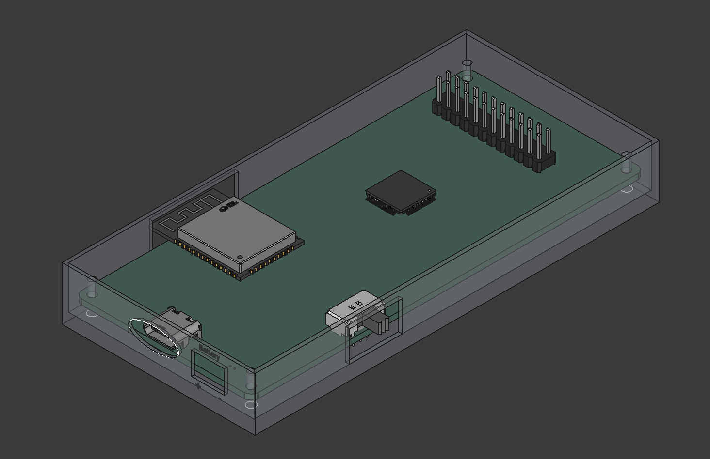

# 3D-Printed Case

This repository contains the files and instructions for a custom 3D-printed enclosure.

## Preview

## Assembly Instructions

1. **Print Files:** Print the two **STL** files included in this repo. (Note; the file called Optional_locking_base is a legacy file with closed ends and requires the below instructions. You dont need to print it though if you are going to tape the lid shut). Normal lid closes but pops open sometimes and the legacy file can keep pcb from flying out.
2. **PCB Installation:** * Insert the **antenna** first.
    * Carefully bend the plastic near the **power button** and slot it in while **aligning** the holes with the **PCB**.
3. **Final Step:** Lastly, put the **cover** on.

