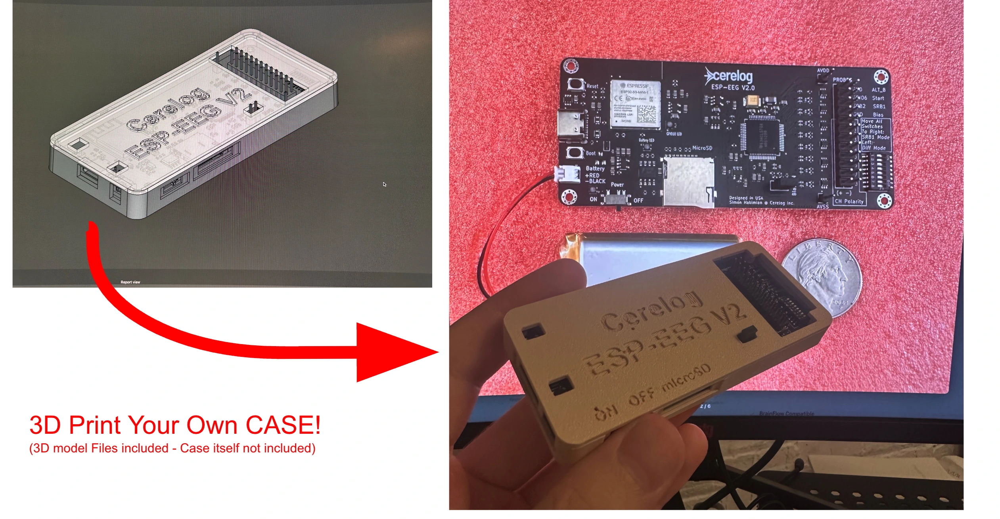
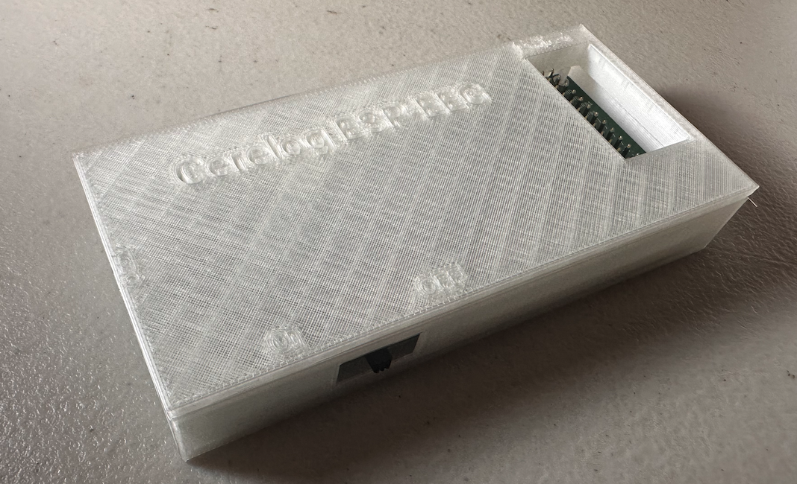
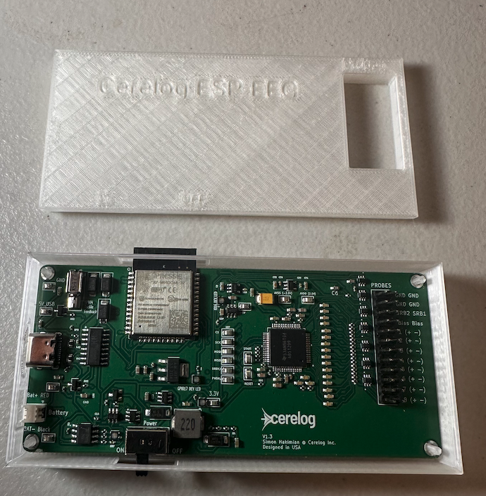
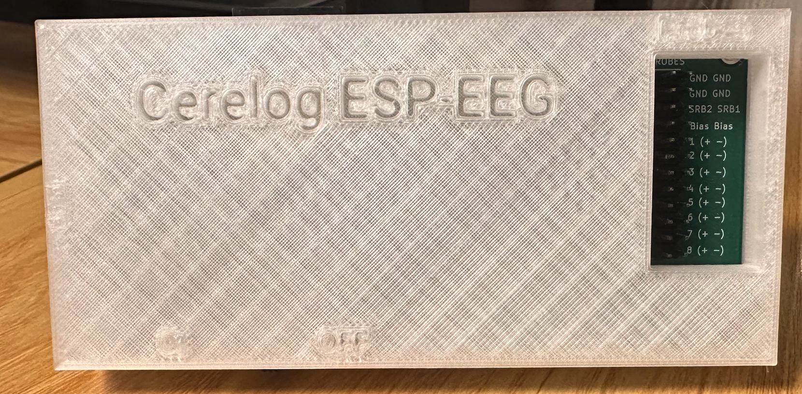
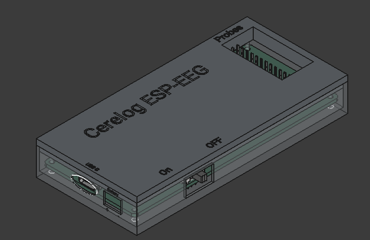
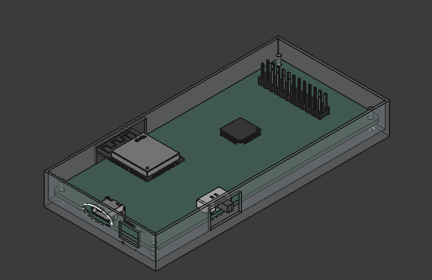

# 3D-Printed Case

This repository contains the files and instructions for custom 3D-printed enclosures designed for the **Cerelog ESP-EEG V1, V2 and 16CH devices**.

| Folder | Device | Size | Notes |
| :--- | :--- | :--- | :--- |
| [`case for 16CH/`](case%20for%2016CH/) | 16-channel | 120.30 x 50.67 x 11.65 mm | Snap fit, no screws. Parametric. Floor openings for the two underside DIP switches. |
| [`case for v2/`](case%20for%20v2/) | V2 | 102.60 x 46.55 x 11.35 mm | Snap fit, no screws. Parametric. |
| [`case for v1/`](case%20for%20v1/) | V1 | 113.23 x 53.98 x 15.00 mm | Legacy, hand-modelled. |

The V2 and 16CH cases are generated from a parametric script rather than modelled by hand — change a constant, re-run, get new STLs. Each folder has its own `README.md`, and a `stl/PRINT.md` with everything you need at the printer.

## Preview for v2 Case Below

|  

## Preview for v1 Case Below

| | | |
| :---: | :---: | :---: |
|  |  |  |
|  |  | |

## Assembly Instructions

1. **Print Files:** Print the two **STL** files included in this repo. 
   > **Note:** The file `Optional_locking_base` is a legacy version with closed ends. You don't need to print it if you plan to tape the lid shut. While the normal lid closes, it can occasionally pop open; the legacy file is designed to prevent the PCB from sliding out.

2. **PCB Installation:**
   * Insert the **antenna** first.
   * Carefully bend the plastic near the **power button** and slot it in while **aligning** the holes with the **PCB**.

3. **Final Step:** Lastly, put the **cover** on.
